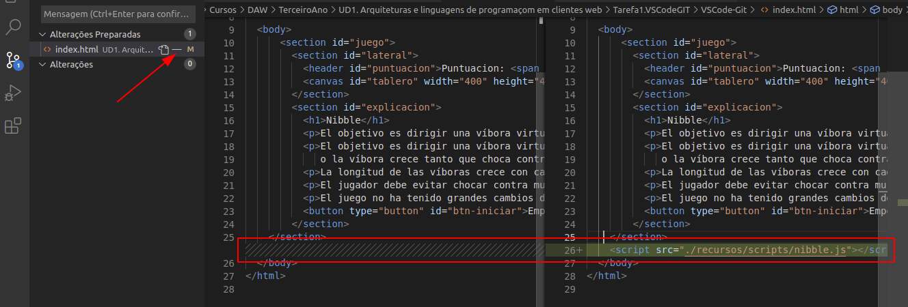

O equipo onde vou fazer o exercício tem instalado un Ubuntu 20.04

* Descarregar e instalar VSCode  
Descargo o paquete `.deb` para ubuntu e instalo con `dpkg -i paquete.deb`. Desde o menú de extensons instalo as pedidas no exercício.
* Descarregar e instalar git  
Instalo con `apt install git`  
* Crear umha conta em GitHub  
Creada co mail de usuário do Sam Clemente, o nóme de usuário é `a19guillermobf`  
* Clonar em VSCode o projeto com URL `https://github.com/mayorandres/VSCode-Git.git`
A primeira vez que abrim o programa aparecia um botom que se chama `clone repository` pero agora que estava repetindo o exercício para fazer as capturas do processo nom me aparece. Em todo caso premendo `F1` e escrevendo `git clone` já se pode introduzir a URL.

Seleccionamos o directório onde se queira gardar e listo.
* Modificar o código HTML5 para incorporar o único script que hai no projecto.

* Provar a abrir o ficheiro com um navegador

* Sube o repositório a um repositório público e baleiro da tua conta de GitHub
Primeiro creo o repositório na página web, e logo co seguinte comando cambiar a origem do projecto  
```
guilherme@PC:/VSCode-Git$ git remote set-url origin https://github.com/a19guillermobf/CodiumGit.git
```
Agora já podo aplicar os cambios e fazer o push para o meu repositório. Primeiro, como o código está em estado de `Modified` prememos no `+` para passa-lo a `staged` 
 
Logo fazemos o `commit`, intriduzimos a mensagem e aceptamos.

E por último o `push` para subi-lo ao repositório

* Comprova que se subeu a github

* Modificar localmente o HTML engadindo um parágrafo co nome e apelidos.
Modifica-se e siguem-se os passos anteriores.  

* Subir ao repositório
